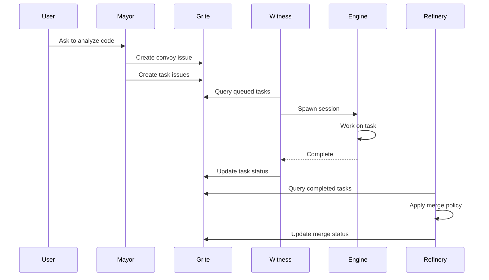

# How Brat Works

Brat is organized in layers, each with a clear responsibility.

## Architecture Overview

```
┌─────────────────────────────────────────────────────────────┐
│                       Your Repository                        │
├──────────────────────────┬──────────────────────────────────┤
│  .brat/                  │  refs/grite/wal                   │
│  ├─ config.toml          │  └─ append-only event log        │
│  └─ workflows/           │                                  │
│     ├─ feature.yaml      │  .git/grite/actors/<id>/sled/     │
│     ├─ fix-bug.yaml      │  └─ local materialized view      │
│     └─ code-review.yaml  │                                  │
├──────────────────────────┴──────────────────────────────────┤
│                    Brat Harness Layer                        │
│  ┌────────┐ ┌─────────┐ ┌──────────┐ ┌────────┐            │
│  │ Mayor  │ │ Witness │ │ Refinery │ │ Deacon │            │
│  └────────┘ └─────────┘ └──────────┘ └────────┘            │
├─────────────────────────────────────────────────────────────┤
│                   Grite Substrate Layer                       │
│  Events • Issues • Labels • Comments • Locks • Sync         │
├─────────────────────────────────────────────────────────────┤
│                    AI Engine Adapters                        │
│  Claude │ Aider │ OpenCode │ Codex │ Continue │ Gemini      │
└─────────────────────────────────────────────────────────────┘
```

## Layers Explained

### 1. AI Engine Adapters

The bottom layer interfaces with AI coding tools. Each engine adapter:

- Spawns agent sessions
- Sends prompts and inputs
- Captures outputs
- Reports health status

Supported engines include Claude Code, Aider, Codex, OpenCode, Continue, and Gemini.

### 2. Grite Substrate

[Grite](https://github.com/neul-labs/grite) provides the persistence layer:

- **Write-Ahead Log (WAL)** - Append-only event storage in `refs/grite/wal`
- **Issues** - Track convoys and tasks
- **Labels** - Store status and metadata
- **Comments** - Record progress and outputs
- **Locks** - Coordinate resources
- **Sync** - Push/pull between repositories

The WAL ensures crash safety. All state can be rebuilt by replaying events.

### 3. Brat Harness Layer

The harness implements the orchestration logic:

| Role | Responsibility |
|------|----------------|
| **Mayor** | AI orchestrator - analyzes code, creates convoys/tasks |
| **Witness** | Spawns and monitors agent sessions |
| **Refinery** | Manages merge queue and integration |
| **Deacon** | Janitor - cleans locks, detects orphans, syncs state |

### 4. Your Repository

Your code, plus:

- `.brat/config.toml` - Configuration file
- `.brat/workflows/` - Reusable workflow templates

## Data Flow



## Storage Locations

| Path | Purpose |
|------|---------|
| `refs/grite/wal` | Append-only event log |
| `.git/grite/actors/<id>/sled/` | Local materialized view per actor |
| `.git/grite/config.toml` | Repo-level Grite config |
| `.brat/config.toml` | Brat configuration |
| `.brat/workflows/` | Workflow templates |

## The Daemon

Brat includes an optional daemon (`bratd`) that provides:

- HTTP API for the web UI
- Multi-session coordination
- Background role supervision
- Idle timeout and auto-shutdown

The daemon is not required for correctness. All CLI commands work standalone.

```bash
# Start the daemon
brat daemon start

# Commands auto-start the daemon by default
# Disable with --no-daemon
brat --no-daemon status
```

## Design Decisions

### Why Append-Only?

Traditional approaches use mutable state (databases, files). This causes:

- Silent failures when crashes corrupt state
- No audit trail of what happened
- Difficulty coordinating multiple writers

Brat's append-only log:

- Never loses events
- Enables deterministic replay
- Provides complete audit trail

### Why Not Use Git Branches?

Using git branches for coordination causes:

- Merge conflicts with metadata
- Dirty working trees
- Race conditions between processes

Brat stores all coordination state in Grite refs, keeping your working tree clean.

### Why Multiple Roles?

Separation of concerns:

- **Mayor** focuses on planning, not execution
- **Witness** focuses on agents, not merging
- **Refinery** focuses on integration, not spawning
- **Deacon** handles cleanup nobody else should worry about

Each role has a clear boundary and can be run independently.
