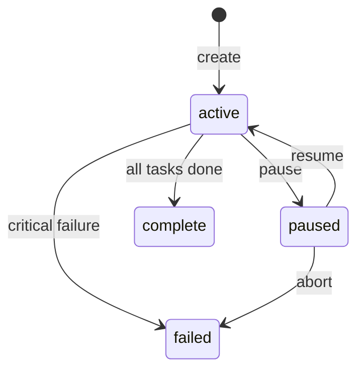

# Convoys and Tasks

Convoys and tasks are how work is organized in Brat.

## What is a Convoy?

A **convoy** is a group of related tasks. Think of it as:

- An epic in agile terminology
- A sprint's worth of work
- A feature branch with multiple commits

Convoys have:

- A title and goal
- A status (active, paused, complete, failed)
- A set of tasks

## What is a Task?

A **task** is an individual work item for an AI agent. Tasks have:

- A title describing the work
- Target paths (files to focus on)
- A status tracking progress
- An optional assignee

## Status Lifecycle

### Convoy Status



| Status | Meaning |
|--------|---------|
| `active` | Convoy is accepting work |
| `paused` | Convoy is temporarily stopped |
| `complete` | All tasks finished successfully |
| `failed` | Convoy was aborted or had critical failure |

### Task Status

```mermaid
stateDiagram-v2
    [*] --> queued: add
    queued --> running: witness picks up
    running --> needs-review: agent completes
    running --> blocked: agent stuck
    blocked --> queued: unblock
    needs-review --> merged: refinery merges
    needs-review --> queued: request changes
    queued --> dropped: cancel
    running --> dropped: cancel
```

| Status | Meaning |
|--------|---------|
| `queued` | Waiting for an agent to pick it up |
| `running` | An agent is actively working on it |
| `blocked` | Agent is stuck, needs intervention |
| `needs-review` | Agent completed, awaiting review/merge |
| `merged` | Changes merged to main branch |
| `dropped` | Task was cancelled |

## Creating Convoys and Tasks

### Manual Creation

```bash
# Create a convoy
brat convoy create --title "Bug fixes" --goal "Fix critical bugs"

# Add tasks to the convoy
brat task add \
  --convoy <convoy-id> \
  --title "Fix null pointer" \
  --paths src/service.rs

brat task add \
  --convoy <convoy-id> \
  --title "Handle timeout error" \
  --paths src/client.rs
```

### Using the Mayor

The Mayor can analyze your code and create tasks automatically:

```bash
brat mayor start
brat mayor ask "Analyze src/ and create tasks for any bugs"
```

## Task Assignment

Tasks can be assigned to specific agents:

```bash
brat task assign <task-id> --assignee <actor-id>
```

Or left unassigned for the Witness to pick up:

```bash
# Witness picks up any queued task
brat witness run --once
```

## Task Structure

Under the hood, tasks are stored as Grit issues with labels:

```
Labels:
  type:task
  task:<task-id>
  convoy:<convoy-id>
  status:queued

Body:
  Title: Fix null pointer in user service
  Paths: src/services/user.rs
  Constraints: Don't change the API signature
  Acceptance: Tests pass
  Notes: See related issue #123
```

## Priorities

Tasks can have priorities:

| Priority | Use Case |
|----------|----------|
| `P0` | Critical, blocks other work |
| `P1` | High priority |
| `P2` | Normal priority |

```bash
brat task add \
  --convoy <id> \
  --title "Critical security fix" \
  --priority P0
```

## Multi-Repository Convoys

Convoys can span multiple repositories:

```bash
# Create a mirror convoy across repos
brat convoy create --mirror --repos /path/to/repo1,/path/to/repo2

# Add a task targeting a specific repo
brat task add \
  --convoy <id> \
  --repo /path/to/repo1 \
  --title "Update shared library"
```

## Best Practices

### Keep Tasks Focused

Each task should be:

- A single logical change
- Completable by one agent in one session
- Testable in isolation

**Good:** "Fix null pointer when user is deleted"
**Bad:** "Fix all bugs in the user service"

### Use Descriptive Titles

Titles should describe the outcome:

**Good:** "Add retry logic to API client"
**Bad:** "Update client.rs"

### Specify Target Paths

Help agents focus by specifying relevant files:

```bash
brat task add \
  --convoy <id> \
  --title "Add input validation" \
  --paths src/forms/login.tsx,src/utils/validate.ts
```

### Group Related Work

Use convoys to group related tasks:

- All tasks for a feature
- All bug fixes for a release
- All security patches
