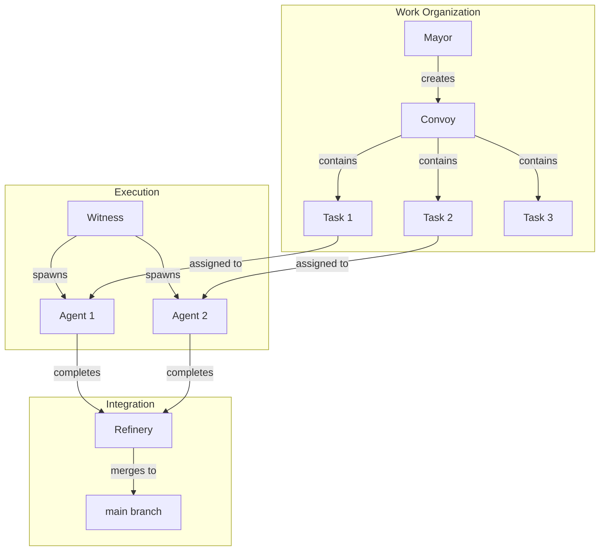

# Concepts

Understanding Brat's core concepts will help you use it effectively.

## Overview

Brat is built around a few key ideas:

1. **Append-only correctness** - All state is stored in an immutable event log
2. **Role-based orchestration** - Specialized roles handle different aspects of the workflow
3. **Work decomposition** - Large tasks are broken into convoys and individual tasks
4. **Engine abstraction** - Multiple AI coding tools work through a unified interface

## Core Concepts

-   :material-sitemap:{ .lg .middle } **How Brat Works**

    ---

    The layered architecture from AI engines to the Git substrate.

    [:octicons-arrow-right-24: Architecture](architecture.md)

-   :material-truck-delivery:{ .lg .middle } **Convoys and Tasks**

    ---

    How work is organized and tracked through the system.

    [:octicons-arrow-right-24: Convoys and Tasks](convoys-and-tasks.md)

-   :material-account-group:{ .lg .middle } **Roles**

    ---

    Mayor, Witness, Refinery, and Deacon - what each does.

    [:octicons-arrow-right-24: Roles](roles.md)

-   :material-robot:{ .lg .middle } **AI Engines**

    ---

    Supported AI coding tools and how they integrate.

    [:octicons-arrow-right-24: Engines](engines.md)

## The Big Picture

## Key Terms

| Term | Definition |
|------|------------|
| **Convoy** | A group of related tasks, like an epic or sprint |
| **Task** | An individual work item for an AI agent |
| **Session** | A running instance of an AI agent working on a task |
| **Engine** | An AI coding tool (Claude Code, Aider, etc.) |
| **Worktree** | An isolated git workspace where an agent makes changes |
| **Grit** | The append-only event log substrate |
| **WAL** | Write-ahead log storing all coordination events |

## Design Principles

### Crash-Safe by Default

All coordination state lives in the Grit WAL (Write-Ahead Log). If anything crashes:

- State can be deterministically rebuilt from the log
- No dirty working trees or corrupted state
- Full audit trail of what happened

### Metadata Stays Out of Git

Brat never writes coordination metadata to tracked files:

- Convoys and tasks are Grit issues, not files
- Status lives in labels, not comments in code
- Your working tree stays clean

### Bounded Operations

All engine calls have timeouts:

- Spawn: 60 seconds
- Send: 5 seconds
- Health check: 5 seconds

This prevents hung agents from blocking the system.
