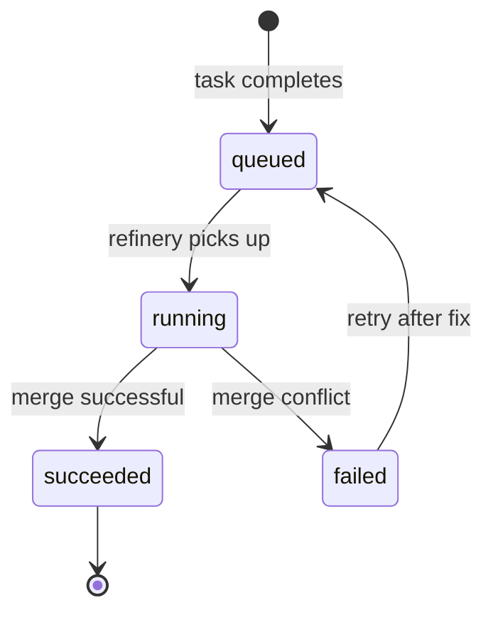
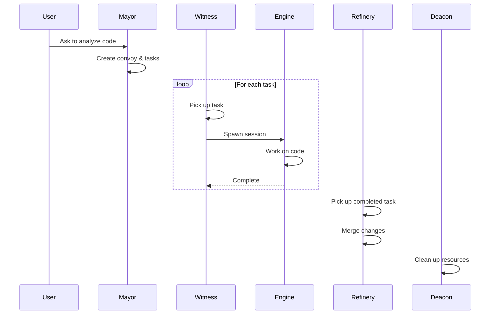

# Roles

Brat uses specialized roles to handle different aspects of multi-agent orchestration.

## Overview

| Role | Primary Function | CLI Command |
|------|-----------------|-------------|
| **Mayor** | AI orchestrator - plans and creates work | `brat mayor` |
| **Witness** | Worker controller - spawns and monitors agents | `brat witness` |
| **Refinery** | Integration controller - manages merge queue | `brat refinery` |
| **Deacon** | Janitor - cleans up and reconciles state | `brat deacon` |

## Mayor

The Mayor is Brat's AI orchestrator. It:

- Analyzes codebases to identify work
- Creates convoys and tasks
- Assigns tasks and updates status
- Communicates with users about progress

### Usage

```bash
# Start the Mayor
brat mayor start

# Ask the Mayor to do something
brat mayor ask "Analyze src/ and identify bugs"

# Check Mayor status
brat mayor status

# Stop the Mayor
brat mayor stop
```

### What the Mayor Does

When you ask the Mayor to analyze code:

1. Scans the specified files/directories
2. Identifies issues, improvements, or features
3. Creates a convoy with a goal
4. Breaks down work into individual tasks
5. Assigns priorities based on severity

### What the Mayor Doesn't Do

- Spawn or manage agent sessions (that's the Witness)
- Merge changes (that's the Refinery)
- Clean up stale resources (that's the Deacon)

## Witness

The Witness turns planned work into running sessions. It:

- Queries for queued tasks
- Creates isolated worktrees
- Spawns AI engine sessions
- Monitors heartbeats and progress
- Posts lifecycle updates to Grit

### Usage

```bash
# Run the Witness once (process queued tasks)
brat witness run --once

# Run the Witness continuously
brat witness run

# The daemon runs the Witness automatically
brat daemon start
```

### Session Management

The Witness manages **polecats** (ephemeral worker sessions):

1. **Spawn**: Creates worktree, starts engine
2. **Monitor**: Watches for heartbeats, progress
3. **Complete**: Records output, updates task status
4. **Cleanup**: Removes worktree on success

### Sessions vs Crews

| Type | Lifecycle | Use Case |
|------|-----------|----------|
| **Polecat** | Ephemeral, Witness-managed | Automated tasks |
| **Crew** | Persistent, user-managed | Interactive work |

## Refinery

The Refinery manages the merge queue and code integration. It:

- Consumes completed task outputs
- Applies merge policies
- Runs CI checks
- Posts merge results

### Usage

```bash
# Run the Refinery once
brat refinery run --once

# Run continuously
brat refinery run
```

### Merge Policies

The Refinery supports multiple merge strategies:

| Policy | Behavior |
|--------|----------|
| `rebase` | Rebase task branch onto main |
| `squash` | Squash commits into one |
| `merge` | Create merge commit |

Configure in `.brat/config.toml`:

```toml
[merge]
policy = "rebase"
required_checks = ["ci"]
```

### Merge Pipeline



## Deacon

The Deacon is the background janitor. It:

- Expires stale locks
- Detects orphaned sessions (no heartbeat)
- Rebuilds projections if needed
- Syncs refs with remotes
- Emits health summaries

### Usage

```bash
# Run the Deacon once
brat deacon run --once

# Run continuously
brat deacon run

# The daemon runs the Deacon automatically
brat daemon start
```

### What Gets Cleaned Up

| Resource | Cleanup Rule |
|----------|--------------|
| Locks | Expired TTL |
| Sessions | No heartbeat for >5 minutes |
| Worktrees | Associated session complete |
| Refs | Orphaned temporary refs |

## Running Roles

### With the Daemon

The easiest way to run roles is with the daemon:

```bash
brat daemon start
```

The daemon supervises all roles automatically.

### Standalone

Run roles individually for testing or scripting:

```bash
# Run each role once
brat witness run --once
brat refinery run --once
brat deacon run --once
```

### In Scripts

Use `--no-daemon` for CI/CD scripts:

```bash
brat --no-daemon witness run --once
brat --no-daemon refinery run --once
```

## Role Interactions



## Customizing Roles

Each role has configurable options in `.brat/config.toml`:

```toml
[witness]
max_concurrent = 3
spawn_timeout = 60

[refinery]
policy = "rebase"
required_checks = ["ci"]

[deacon]
cleanup_interval = 300
lock_ttl = 900
```

See [Configuration](../configuration/config-file.md) for details.
