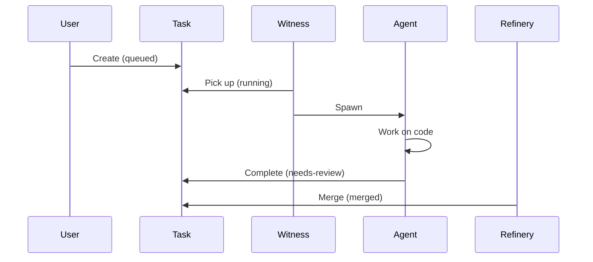

# Managing Tasks

Tasks are individual work items for AI agents. This guide covers task operations.

## Adding Tasks

### Basic Task

```bash
brat task add \
  --convoy <convoy-id> \
  --title "Fix null pointer in user service" \
  --paths src/services/user.rs
```

### With Priority

```bash
brat task add \
  --convoy <convoy-id> \
  --title "Critical security fix" \
  --paths src/auth/login.rs \
  --priority P0
```

| Priority | Use Case |
|----------|----------|
| `P0` | Critical, blocks other work |
| `P1` | High priority |
| `P2` | Normal priority |

### Solo Task (No Convoy)

For quick, one-off tasks:

```bash
brat task add --solo --title "Quick typo fix" --paths README.md
```

## Listing Tasks

```bash
# List all tasks
brat task list

# Filter by label
brat task list --label status:queued
brat task list --label priority:P0

# JSON output
brat task list --json

# Across all repos
brat task list --all-repos
```

## Viewing Task Details

```bash
brat task show <task-id>

# JSON output
brat task show <task-id> --json
```

Shows:

- Task title and paths
- Current status
- Assigned agent (if any)
- Comments and history

## Task Status

| Status | Meaning |
|--------|---------|
| `queued` | Waiting for an agent |
| `running` | Agent actively working |
| `blocked` | Agent stuck, needs help |
| `needs-review` | Agent completed, awaiting review |
| `merged` | Changes merged to main |
| `dropped` | Task cancelled |

## Assigning Tasks

Assign a task to a specific agent:

```bash
brat task assign <task-id> --assignee <actor-id>
```

Leave unassigned for the Witness to auto-assign:

```bash
brat witness run --once
```

## Adding Comments

Add context or feedback:

```bash
brat task comment <task-id> --body "The API signature should not change"
```

Comments are visible to agents and help guide their work.

## Closing Tasks

Close a completed task:

```bash
brat task close <task-id> --reason done
```

Cancel a task:

```bash
brat task close <task-id> --reason dropped
```

## Running Tasks

The Witness spawns agents for queued tasks:

```bash
# Run once
brat witness run --once

# Run continuously
brat witness run
```

## Monitoring Tasks

### Watch Status

```bash
brat status --watch
```

### View Running Sessions

```bash
brat session list
```

### Tail Session Logs

```bash
brat session tail <session-id>
brat session tail <session-id> --lines 200
```

## Task Lifecycle



## Handling Blocked Tasks

When a task is blocked:

1. Check the task details:
   ```bash
   brat task show <task-id>
   ```

2. View agent logs:
   ```bash
   brat session tail <session-id>
   ```

3. Add clarifying comments:
   ```bash
   brat task comment <task-id> --body "Additional context..."
   ```

4. Reassign or requeue:
   ```bash
   brat task assign <task-id> --assignee <new-actor>
   ```

## Example Workflow

```bash
# 1. Create tasks
brat task add --convoy convoy-abc123 \
  --title "Add input validation" \
  --paths src/forms/login.tsx \
  --priority P1

brat task add --convoy convoy-abc123 \
  --title "Add error handling" \
  --paths src/api/client.ts \
  --priority P2

# 2. View tasks
brat task list

# 3. Run agents
brat witness run --once

# 4. Monitor
brat session list
brat session tail <session-id>

# 5. Check completion
brat task list --label status:needs-review

# 6. Merge
brat refinery run --once
```

## Best Practices

### Write Clear Titles

**Good:** "Add retry logic with exponential backoff to API client"
**Bad:** "Fix API"

### Specify Target Paths

```bash
brat task add \
  --convoy <id> \
  --title "Add caching" \
  --paths src/services/cache.ts,src/utils/storage.ts
```

Helps agents focus on relevant code.

### Keep Tasks Atomic

Each task should be:

- A single logical change
- Completable in one session
- Testable in isolation

### Add Context via Comments

```bash
brat task add --convoy <id> --title "Optimize query"
brat task comment <task-id> --body "Focus on the N+1 query issue in getUserPosts()"
```

### Use Priorities

Reserve P0 for truly critical work:

- Security vulnerabilities
- Data corruption bugs
- Blocking issues

Use P1/P2 for regular work.
